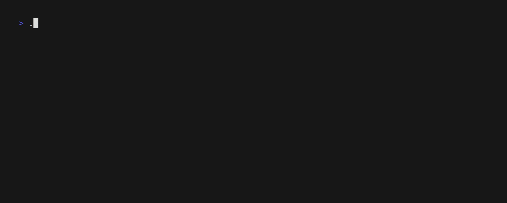

# Potatoes 🥔🥕🥔🥕🥔

A personal favored `Todo-list command line application`, written with [bubbletea](https://github.com/charmbracelet/bubbletea).

Supports two keyboard layouts QWERTY (default) and [Colemak](https://colemak.com/)

## Shortcuts (QWERTY)

|       keys       |         Description         |
| :--------------: | :-------------------------: |
|      ↑ / k       |             UP              |
|      ↓ / j       |            Down             |
|  Space / Enter   |       Select a entry        |
|        a         | Append a new `normal` entry |
|        A         | Append a new `daily` entry  |
|        D         |       Delete a entry        |
|        ?         |         Toggle help         |
| q / ESC / Ctrl+c |            Quit             |

## Shortcuts (Colemak)

|       keys       |         Description         |
| :--------------: | :-------------------------: |
|      ↑ / u       |             UP              |
|      ↓ / e       |            Down             |
|  Space / Enter   |       Select a entry        |
|        a         | Append a new `normal` entry |
|        A         | Append a new `daily` entry  |
|        D         |       Delete a entry        |
|        ?         |         Toggle help         |
| q / ESC / Ctrl+c |            Quit             |

## Demo

